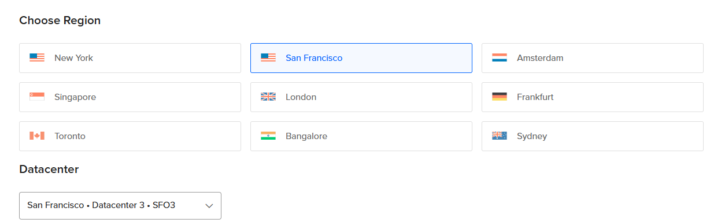
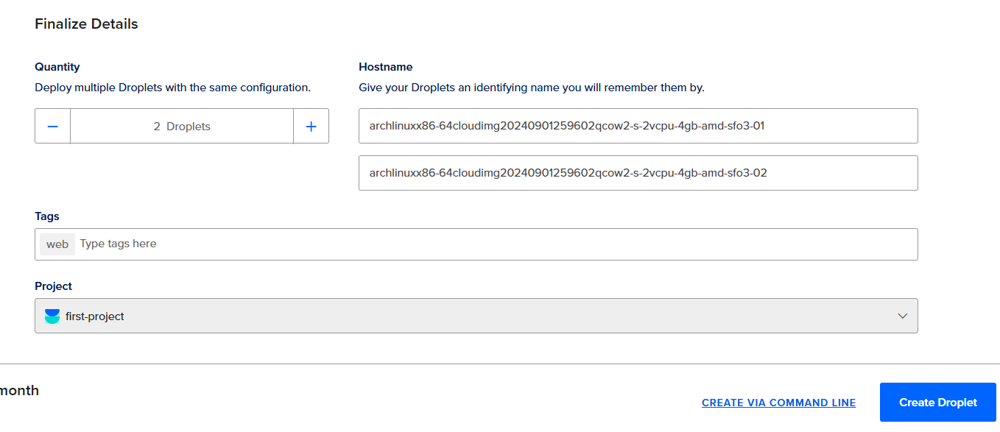
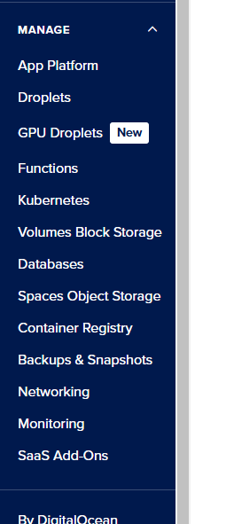
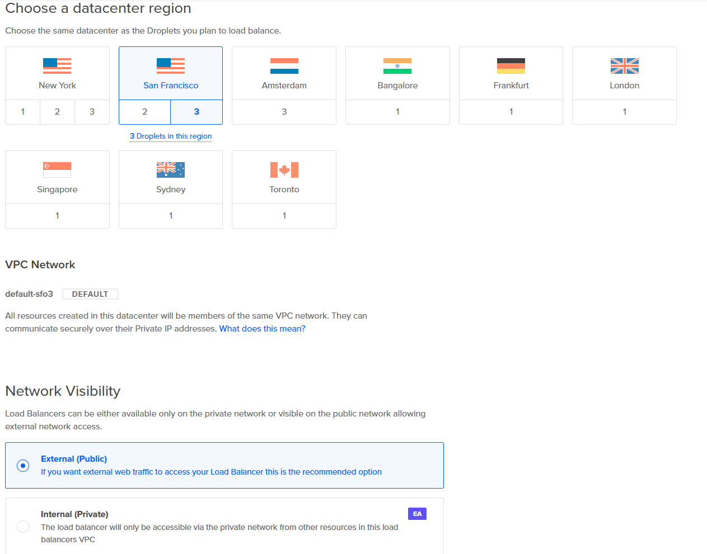
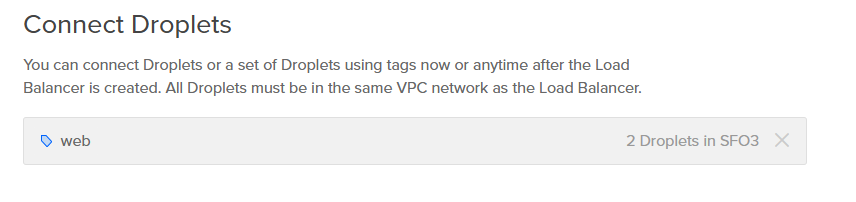

# ACIT 2420 - Assignment 3 Part 2: Working with Load Balancing multiple droplets

## Introduction
This README continues the assignment's part 1 in setting up a bash script that generates a static index.html file containing system information and configuring an NGINX web server. This README will will guide you on the instructions on how to set up 2 DigitalOcean droplets and a load balancer to distribute the traffic between the two droplets. The final outcome should allow you to displays files from a documents directory on the server by inputting the `<load balancer's IP address>/documents` into the URL of a web browser.

The completed configuration of our droplets will have a file tree that look like this in the user `webgen`'s home directory:
```
.
├── bin/
│    └── generate_index
├── documents/
│    ├── file-one
│    └── file-two
└── HTML/
     └── index.html
```

## Table of Contents

1. [Introduction](#introduction)
2. [Step 1: Creating new Droplets and Load Balancer](#step-1-creating-new-droplets)
3. [Setting Up New System User and Files](#setting-up-new-system-user-and-files)
3. [Step 2: Set Up System User](#step-2-set-up-system-user)
4. [Step 3: Unit File Configuration](#step-3-unit-file-configuration)
5. [Step 4: Nginx Configuration](#step-4-nginx-configuration)
6. [Step 5: Setting Up UFW](#step-5-setting-up-ufw)
7. [Step 6: Verifying the Configuration](#step-6-verifying-the-configuration)
8. [References](#references)

## Step 1: Creating new Droplets and Load Balancer
On DigitalOcean, begin by creating two new droplets.

1. Press the green "Create" button at the top of the page and press "Create Droplet"
2. For our case, select San Francisco Data center 3.



3. Keep VPC network as `Default`
4. Select our Arch Linux custom image.
5. At the bottom of the page, select 2 droplets and add the tag `web`.



6. Press `Create Droplet`

Moving onto creating the load balancer,

1. Select Networking from the left hand menu.



2. Select "Create a Regional or Global Load Balancer"
3. Similar to our droplets, we will select `San Francisco Datacenter 3` again.
4. Keep the VPC network as `default`
5. keep network visibility as `public`



6. Make sure number of nodes is 2
7. Add `web` tag to the connected droplets



8. Press `Create Load balancer`.

**Note**: The load balancer will say it it's status is down until you configure apply the NGINX web server settings.

## Setting Up New System User and Files
**Note**: Steps 2 to 7 will require you to perform them on both DigitalOcean droplets.

We need to create a system user called `webgen` with a home directory at `/var/lib/webgen` and a login shell for a non-user.

The benefit of creating a system user rather than a regular user or root is so we can separate our files and other directories from our current user to prevent malicious attacks using something like the `chown` command. As for using system user instead of root, it prevents an attack from taking advantage of the elevated privileges within our system.[1][2]

## Step 2: Set Up System User

1. Enter the following command to create a system user with a custom home directory path with a non-login user shell:

    `sudo useradd -r -d /var/lib/webgen -s /usr/sbin/nologin webgen`

-r: Creates a system account

-d: Specifies the home directory

-s: Specifies the user's login shell. In our case, `/usr/sbin/nologin` means a no interactive login user shell

Typically, the creation of a system user does not have a home directory, therefore by stating -d, we create a path to the home directory.[1]

2. Create the actual home directory for the webgen user since it doesn't exist yet by entering the command:

    `sudo mkdir -p /var/lib/webgen`

3. Create the subdirectories needed for this script using the command:

    `sudo mkdir -p /var/lib/webgen/bin /var/lib/webgen/HTML`


4. Clone this repository to your home directory and move the generate_script using the following commands:
    
    `git clone https://git.sr.ht/~nathan_climbs/2420-as3-p2-start`
 
    `sudo cp ~/2420-as3-p2-start/generate_index /var/lib/webgen/bin/`

    **Note:** Since it is a new droplet, you may need to install git using the command: `sudo pacman -S git`. Also, this cloned start code is different from part 1!

5. Give generate_script the permission to execute the script by entering the following command:

    `sudo chmod +x /var/lib/webgen/bin/generate_index`

6. Create the index.html file in the `/var/lib/webgen/HTML` folder by entering the command:

    `sudo touch /var/lib/webgen/HTML/index.html`

7. Create two files called `file-one` and `file-two` in the `documents` directory. Enter the command:

    `sudo touch /var/lib/webgen/documents/file-one /var/lib/webgen/documents/file-two`

7. Change the ownership of the files and dictories to webgen using the command:

    `sudo chown -R webgen:webgen /var/lib/webgen`

-R: Recursive. It will iterate through all the files in the directory.[3]

## Step 3: Unit File Configuration

We will need a .service file in order to execute our script as well as a .timer file to execute it at 5:00 AM every day.[4]

1. Create the unit files in the `/etc/systemd/system` directory as a sudouser or as root. Enter the command:

`sudo nvim /etc/systemd/system/generate-index.service`

and paste the following into the file and save it:

    [Unit]
    Description=Generate static index.html

    [Service]
    Type=oneshot
    User=webgen
    Group=webgen
    ExecStart=/var/lib/webgen/bin/generate_index

Next, create the timer unit file by entering the command:

`sudo nvim /etc/systemd/system/generate-index.timer`

Then paste the following inside and save it:

    [Unit]
    Description=Run daily at 05:00 that creates a static HTML page

    [Timer]
    OnCalendar=05:00
    Persistent=true
    [Install]
    WantedBy=timers.target

2. Enable the timer on startup by entering the command:

`sudo systemctl enable generate-index.timer`

3. Start the timer by entering the command:

`sudo systemctl start generate-index.timer`

We can check if the timer is active by typing the command: 

`sudo systemctl status generate-index.timer`

To test our service is working, type 

`sudo systemctl start generate-index.service`

If successful, we can check by entering: `systemctl status generate-index.service` and checking the logs.[4]

## Step 4: Nginx Configuration

1. Install Nginx

Enter the command to install Nginx:

`sudo pacman -S nginx`

2. Modify the `nginx.conf` file, enter:

`sudo nvim /etc/nginx/nginx.conf`

Change the `user` to webgen at the top of the file. It should look like:

        user webgen webgen;

The reason we put 2 webgen is because the first webgen states the user, and the second webgen states the usergroup.

Next, inside the http block, add:
        
        http{
            ...
            include /etc/nginx/sites-enabled/*;
            ...
        }

This will load in the configuration files. We will create the directories and its files in the next few steps.[5]

3. Checking your `nginx.conf` file

Make sure there are no errors with the file using the command:

`sudo nginx -t`

4. Create 2 new directories called "sites-available" and "sites-enabled" inside `/etc/nginx` by entering the commands:

`sudo mkdir -p /etc/nginx/sites-available` and `sudo mkdir -p /etc/nginx/sites-enabled`

5. Now, we will create a separate file for webgen inside "sites-available".

Enter the command: `sudo nvim /etc/nginx/sites-available/webgen`

Then create a new server block inside the file by copying and pasting the following:

```
server {
    listen 80;
    listen [::]:80;

    server_name local_host.webgen;

    index index.html;

    location / {

        root /var/lib/webgen/HTML;
        index index.html;
        try_files $uri $uri/ =404;
    }

    location /documents {

        alias /var/lib/webgen/documents/;
        autoindex on;
        autoindex_exact_size off;
        autoindex_localtime on;
        try_files $uri $uri/ =404;
    }
}
```

`listen 80` and `listen [::]:80` listens for incoming connections on both IPv4 and IPv6 on port 80 for the domain name `local_host.webgen`.[5][6]

`server_name` is the domain name we declared.

`root` signifies where we should look in order to find the file to host in response to the request that we received. So we will look at the `/var/lib/webgen/HTML` directory.

`index` signifies the file to serve to the user when the directory is accessed. In our case, the default file `index.html` will be served.

`location /` block chooses how the server handles the request based on the URL. In our case, the / path means it handles requests sent to `http://<our-ip-address>/`

`location /documents` block chooses how the server handles the request based on the URL. In our case, the /documents path means it handles requests sent to `http://<our-ip-address>/documents` and returns the file tree from our `documents` directory.

`try_files $uri $uri/ =404` will check if the requested file is found and hosts it, if not, it will return a 404 error.[6]

By completing steps 4 and 5 and separating the server files from the config file, it allows us to have some modularity in the code and be able to turn off and on each server that we want by creating symlinks between sites-enabled and sites-available.

6. Enable Server Block

Now that we have created the server block, we will enable it by creating a symlink from the server block file to the `/etc/nginx/sites-enabled` directory. We will then add the sites-enabled files to the `nginx.conf` file to enable it. 

Enter the command: `sudo ln -s /etc/nginx/sites-available/webgen /etc/nginx/sites-enabled/`

7. Restart your nginx service

After all the changes, we must restart our Nginx service. Enter the command:

`sudo systemctl restart nginx`

Check that Nginx service is working as intended by entering:

`systemctl status nginx`

**Note:** You may receive the error "Could not build optimal types_hash". Refer to section 6.4 of the https://wiki.archlinux.org/title/Nginx wiki page.[5]

## Step 5: Setting Up UFW

We will now set up the Uncomplicated Firewall (UFW) to help secure our server.

1. Install UFW

Enter the command: `sudo pacman -S ufw`

2. Enable HTTP and SSH connections

Enter the commands: `sudo ufw allow SSH` and `sudo ufw allow http`

3. Enable SSH rate limiting

Enter the command: `sudo ufw limit SSH`

By limiting the SSH rate, the UFW will deny connections from an IP address that has attempted to initiate 6 or more connections in the last 30 seconds.[7]

4. Enable the UFW

**WARNING**: Do not do this if you have not completed steps 2 and 3, otherwise you will not be able to access the server anymore.

Enter the command: `sudo ufw enable`

**Note:** You can check your firewall status by entering the command:

`sudo ufw status`

You will be presented with an output such as:

    Status: active

    To                         Action      From
    --                         ------      ----
    SSH                        LIMIT       Anywhere
    80                         ALLOW       Anywhere
    SSH (v6)                   LIMIT       Anywhere (v6)
    80 (v6)                    ALLOW       Anywhere (v6)

If it says Status: active, then congratulations! Your firewall is now operational.

## Step 6: Verifying the Configuration

To Verify the website is working, we need to get the IP address from our droplet on Digital Ocean.

1. On DigitalOcean, open the droplets menu from the left and copy the IPv4 Address


2. In your browser, enter the IP address in your URL bar and enter it. If successful, the output should look like this:


Congratulations!, you have successfully configured your Nginx web server to host a static HTML that updates every day at 5:00 AM UTC, and you also successfully secured your server using UFW!.

# References

[1] "useradd(8) - Linux manual page," *man useradd*. [Online]. Available: https://man7.org/linux/man-pages/man8/useradd.8.html. [Accessed: Nov. 19, 2024].

[2] ArchWiki, "Users and groups," *Arch Linux Wiki*. [Online]. Available: https://wiki.archlinux.org/title/Users_and_groups. [Accessed: Nov. 19, 2024].

[3] Linux Foundation, "chown - Change file owner and group," *Linux Man Pages*, 2024. [Online]. Available: https://man7.org/linux/man-pages/man1/chown.1.html. [Accessed: Nov. 24, 2024].

[4] DigitalOcean, "Understanding Systemd Units and Unit Files," *DigitalOcean Community Tutorials*. [Online]. Available: https://www.digitalocean.com/community/tutorials/understanding-systemd-units-and-unit-files. [Accessed: Nov. 24, 2024].

[5] ArchWiki, "Nginx," *Arch Linux Wiki*. [Online]. Available: https://wiki.archlinux.org/title/Nginx. [Accessed: Nov. 19, 2024].

[6] "Understanding Nginx Server and Location Block Selection Algorithms," *DigitalOcean Community Tutorials*. [Online]. Available: https://www.digitalocean.com/community/tutorials/understanding-nginx-server-and-location-block-selection-algorithms. [Accessed: Nov. 24, 2024].

[7] ArchWiki, "Uncomplicated Firewall," *Arch Linux Wiki*. [Online]. Available: https://wiki.archlinux.org/title/Uncomplicated_Firewall. [Accessed: Nov. 24, 2024].